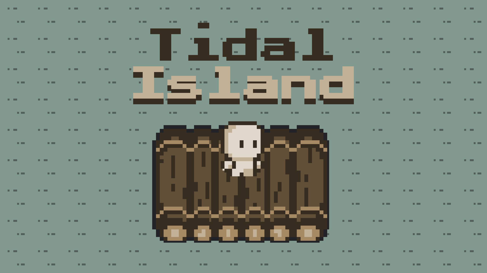

<div align="center">

[](https://github.com/andrianllmm/tidal-island/releases/latest)

[](https://github.com/andrianllmm/tidal-island/actions)
[](https://github.com/andrianllmm/tidal-island/stargazers)
[](https://github.com/andrianllmm/tidal-island/blob/main/LICENSE)

# Tidal Island

**A survival game where players escape an island before it submerges!**

[](https://github.com/andrianllmm/tidal-island/releases/latest)

</div>

<div align="center">
    
</div>

## About

_Tidal Island_ is a survival game where you're stranded on a deserted island and must gather resources and craft items to escape. You must progress toward building a raft to escape before the tides get too high and submerge the island!

## Features

- **Resource Gathering**: Interact with trees, rocks, and bushes to collect materials
- **Crafting System**: Combine resources to create tools and ultimately build your escape raft
- **Survival Mechanics**: Manage health and hunger as you race against time
- **Dynamic Tidal System**: Watch as the ocean gradually floods the island

## Installation

1. Go to the [latest release](https://github.com/andrianllmm/tidal-island/releases/latest) on GitHub
2. Download the installer for your operating system:

   - **Windows**: `.msi` file
   - **Mac**: `.dmg` file
   - **Linux**: `.deb` (Debian/Ubuntu) or `.rpm` (Fedora/openSUSE)

3. Install the game
4. Once installed, open the game from your applications menu
5. Enjoy escaping the island!

## How to Play

### Objective

1. **Gather Resources**: Approach trees, rocks, and bushes and collect them
2. **Craft Items**: Open your inventory and crafting bence to create items like plnaks and axes (see [recipebook.json](/src/main/resources/recipes/recipebook.json))
3. **Build a Raft**: Collect enough materials to craft a raft
4. **Escape**: Place the raft on water and board it before the island is fully flooded

### Controls

| Action     | Keys       |
| ---------- | ---------- |
| Move Up    | `W` or `↑` |
| Move Down  | `S` or `↓` |
| Move Left  | `A` or `←` |
| Move Right | `D` or `→` |
| Interact   | `E`        |
| Inventory  | `I`        |
| Crafting   | `C`        |
| Pause      | `ESC`      |
| Fullscreen | `F`        |

Configuration in [keybindings.json](/src/main/resources/keybindings/keybindings.json)

## Development

### Prerequisites

- Java Development Kit (JDK) 17 or higher
- Maven 3.6+

### Installation

1. **Clone the repository**

   ```bash
   git clone https://github.com/andrianllmm/tidal-island.git
   cd tidal-island
   ```

2. **Build the project**

   ```bash
   mvn clean package
   ```

3. **Run the game**

   ```bash
   java -jar target/tidal-island.jar
   ```

4. **Or use exec**

   ```bash
   mvn clean compile exec:java@main
   ```

### Configuration

Game settings can be modified in [`config.json`](/src/main/resources/config.json):

### Built With

- **Java 17** - Programming language
- **Maven** - Dependency management and build tool
- **Java AWT/Swing** - Graphics and UI
- **Jackson** - JSON parsing
- **JUnit 5** - Testing framework
- **AssertJ** - Fluent assertions for tests

### Project Structure

```
tidal-island/
├── src/
│   ├── main/
│   │   ├── java/
│   │   │   └── io/tidalisland/
│   │   │       ├── collision/     # Collision detection system
│   │   │       ├── config/        # Configuration management
│   │   │       ├── crafting/      # Crafting system
│   │   │       ├── entities/      # Player and living entities
│   │   │       ├── engine/        # Core game engine
│   │   │       ├── graphics/      # Rendering and sprites
│   │   │       ├── input/         # Input handling
│   │   │       ├── inventory/     # Inventory system
│   │   │       ├── items/         # Item definitions (food, tools, etc.)
│   │   │       ├── states/        # Game state management
│   │   │       ├── tide/          # Tidal flooding system
│   │   │       ├── tiles/         # Tile and map system
│   │   │       ├── ui/            # User interface
│   │   │       ├── worldobjects/  # World objects (trees, rocks, etc.)
│   │   │       └── worldbuilder/  # Map editor
│   │   └── resources/
│   │       ├── maps/              # Map data
│   │       ├── recipes/           # Crafting recipes
│   │       ├── sprites/           # Game sprites
│   │       └── tilesets/          # Tile definitions
│   └── test/                      # Unit tests
└── pom.xml                        # Maven configuration
```

### Architecture

See [System Design Documentation](docs/system/system.md) for detailed architecture information.

### Testing

Run the tests with

```bash
mvn test
```

## Contributing

Contributions are welcome! To get started:

1. Fork the project
2. Create your feature branch (`git checkout -b feature/AmazingFeature`)
3. Commit your changes (`git commit -m 'Add some AmazingFeature'`)
4. Push to the branch (`git push origin feature/AmazingFeature`)
5. Open a pull request

## Issues

Found a bug or issue? Report it on the
[issues page](https://github.com/andrianllmm/tidal-island/issues).
