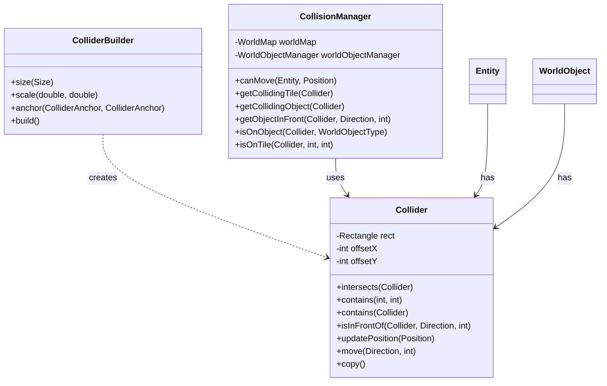
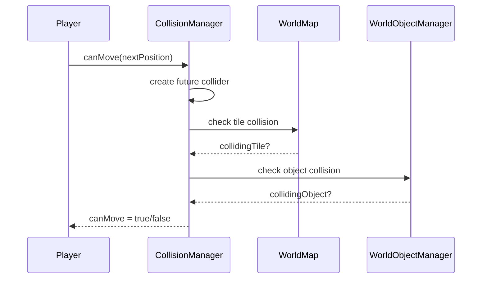

# Collision System

The collision system provides spatial queries and collision detection.

```mermaid
classDiagram
    class Collider {
        -Rectangle rect
        -int offsetX
        -int offsetY
        +intersects(Collider)
        +contains(int, int)
        +contains(Collider)
        +isInFrontOf(Collider, Direction, int)
        +updatePosition(Position)
        +move(Direction, int)
        +copy()
    }

    class CollisionManager {
        -WorldMap worldMap
        -WorldObjectManager worldObjectManager
        +canMove(Entity, Position)
        +getCollidingTile(Collider)
        +getCollidingObject(Collider)
        +getObjectInFront(Collider, Direction, int)
        +isOnObject(Collider, WorldObjectType)
        +isOnTile(Collider, int, int)
    }

    class ColliderBuilder {
        +size(Size)
        +scale(double, double)
        +anchor(ColliderAnchor, ColliderAnchor)
        +build()
    }

    ColliderBuilder ..> Collider: creates
    CollisionManager --> Collider: uses
    Entity --> Collider: has
    WorldObject --> Collider: has
```

## Collision Detection Flow

```mermaid
sequenceDiagram
    participant Player
    participant CollisionManager
    participant WorldMap
    participant WorldObjectManager

    Player->>CollisionManager: canMove(nextPosition)
    CollisionManager->>CollisionManager: create future collider
    CollisionManager->>WorldMap: check tile collision
    WorldMap-->>CollisionManager: collidingTile?
    CollisionManager->>WorldObjectManager: check object collision
    WorldObjectManager-->>CollisionManager: collidingObject?
    CollisionManager-->>Player: canMove = true/false
```
