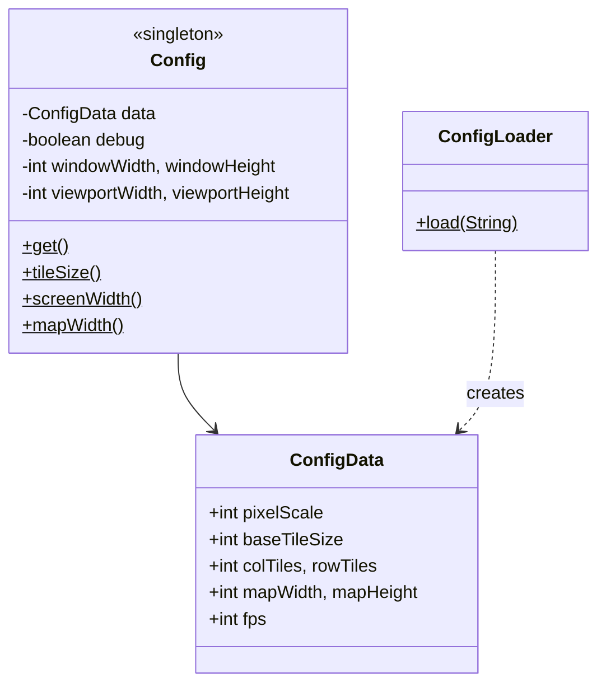

# Configuration System

Centralized configuration with JSON loading.

```mermaid
classDiagram
    class Config {
        <<singleton>>
        -ConfigData data
        -boolean debug
        -int windowWidth, windowHeight
        -int viewportWidth, viewportHeight
        +get()$
        +tileSize()$
        +screenWidth()$
        +mapWidth()$
    }

    class ConfigData {
        +int pixelScale
        +int baseTileSize
        +int colTiles, rowTiles
        +int mapWidth, mapHeight
        +int fps
    }

    class ConfigLoader {
        +load(String)$
    }

    Config --> ConfigData
    ConfigLoader ..> ConfigData: creates
```
