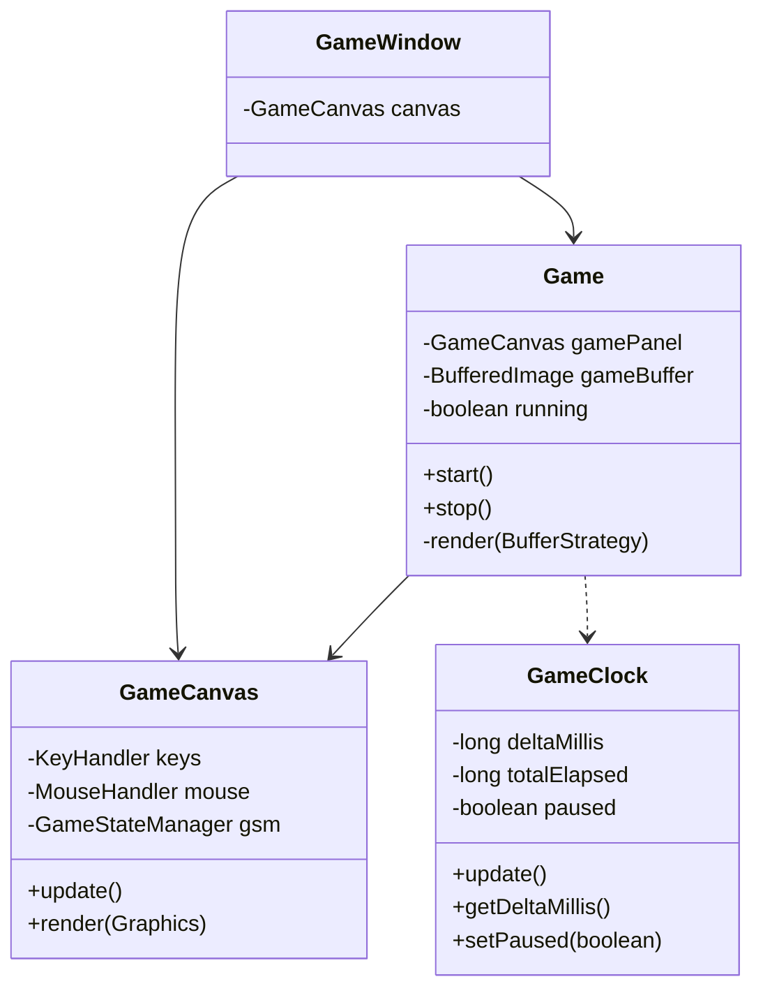
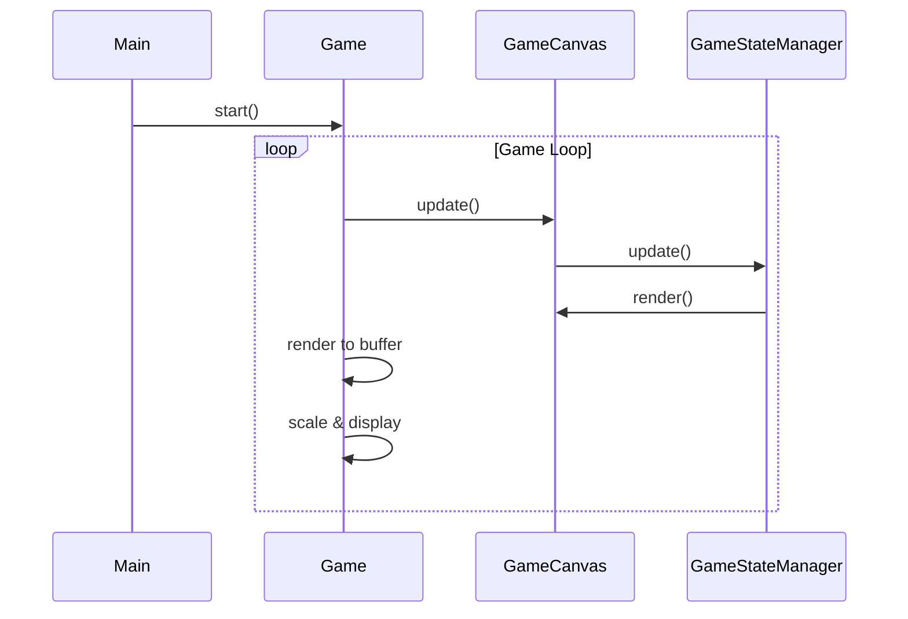
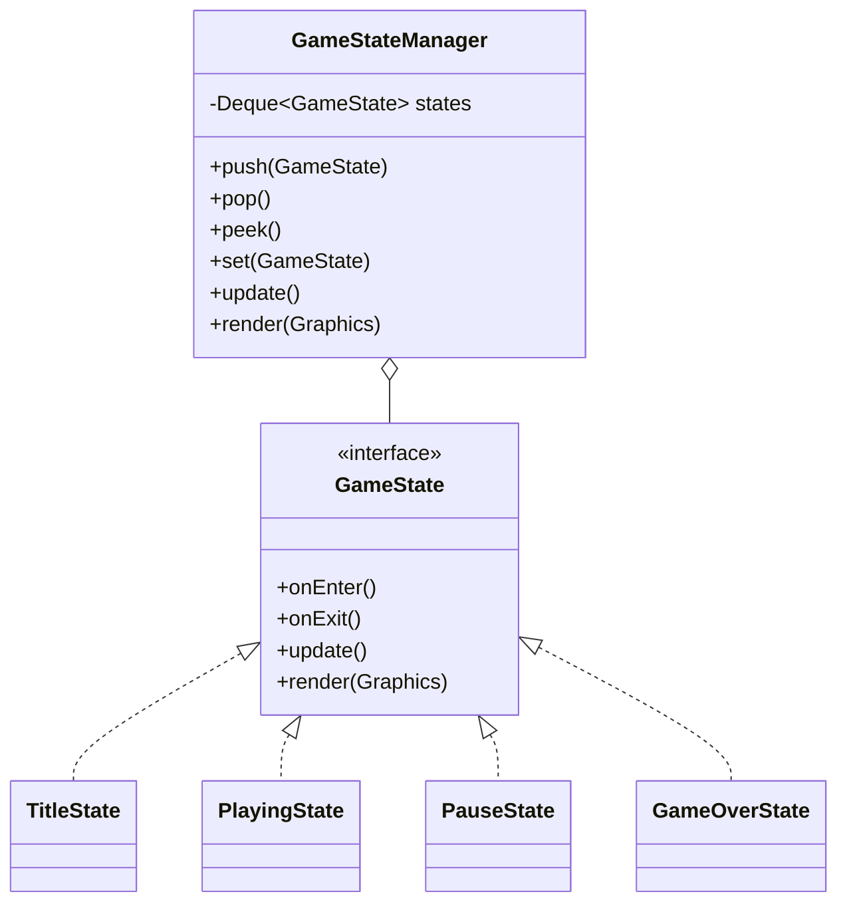
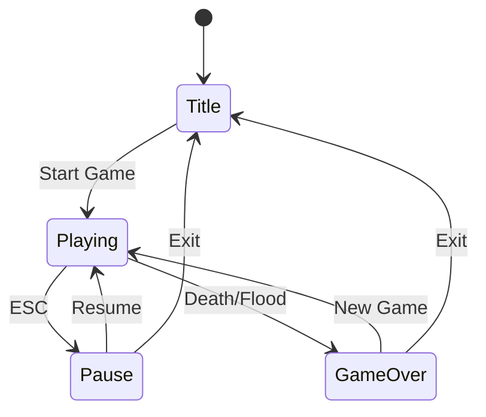

# Engine System

## Game Engine

```mermaid
classDiagram
    class Game {
        -GameCanvas gamePanel
        -BufferedImage gameBuffer
        -boolean running
        +start()
        +stop()
        -render(BufferStrategy)
    }

    class GameCanvas {
        -KeyHandler keys
        -MouseHandler mouse
        -GameStateManager gsm
        +update()
        +render(Graphics)
    }

    class GameWindow {
        -GameCanvas canvas
    }

    class GameClock {
        -long deltaMillis
        -long totalElapsed
        -boolean paused
        +update()
        +getDeltaMillis()
        +setPaused(boolean)
    }

    Game --> GameCanvas
    GameWindow --> Game
    GameWindow --> GameCanvas
    Game ..> GameClock
```

## Game Loop

```mermaid
sequenceDiagram
    participant Main
    participant Game
    participant GameCanvas
    participant GameStateManager

    Main->>Game: start()
    loop Game Loop
        Game->>GameCanvas: update()
        GameCanvas->>GameStateManager: update()
        GameStateManager->>GameCanvas: render()
        Game->>Game: render to buffer
        Game->>Game: scale & display
    end
```

## State Management System

The game uses a stack-based state machine for managing different game screens.

```mermaid
classDiagram
    class GameState {
        <<interface>>
        +onEnter()
        +onExit()
        +update()
        +render(Graphics)
    }

    class GameStateManager {
        -Deque~GameState~ states
        +push(GameState)
        +pop()
        +peek()
        +set(GameState)
        +update()
        +render(Graphics)
    }

    GameState <|.. TitleState
    GameState <|.. PlayingState
    GameState <|.. PauseState
    GameState <|.. GameOverState
    GameStateManager o-- GameState
```

### State Transitions

```mermaid
stateDiagram-v2
    [*] --> Title
    Title --> Playing: Start Game
    Playing --> Pause: ESC
    Pause --> Playing: Resume
    Pause --> Title: Exit
    Playing --> GameOver: Death/Flood
    GameOver --> Playing: New Game
    GameOver --> Title: Exit
```
