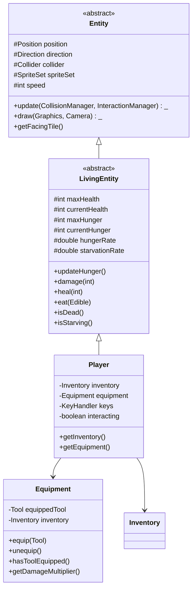

```mermaid
classDiagram
class Entity {
<<abstract>>
#Position position
#Direction direction
#Collider collider
#SpriteSet spriteSet
#int speed
+update(CollisionManager, InteractionManager)_
+draw(Graphics, Camera)_
+getFacingTile()
}

    class LivingEntity {
        <<abstract>>
        #int maxHealth
        #int currentHealth
        #int maxHunger
        #int currentHunger
        #double hungerRate
        #double starvationRate
        +updateHunger()
        +damage(int)
        +heal(int)
        +eat(Edible)
        +isDead()
        +isStarving()
    }

    class Player {
        -Inventory inventory
        -Equipment equipment
        -KeyHandler keys
        -boolean interacting
        +getInventory()
        +getEquipment()
    }

    class Equipment {
        -Tool equippedTool
        -Inventory inventory
        +equip(Tool)
        +unequip()
        +hasToolEquipped()
        +getDamageMultiplier()
    }

    Entity <|-- LivingEntity
    LivingEntity <|-- Player
    Player --> Equipment
    Player --> Inventory
```
