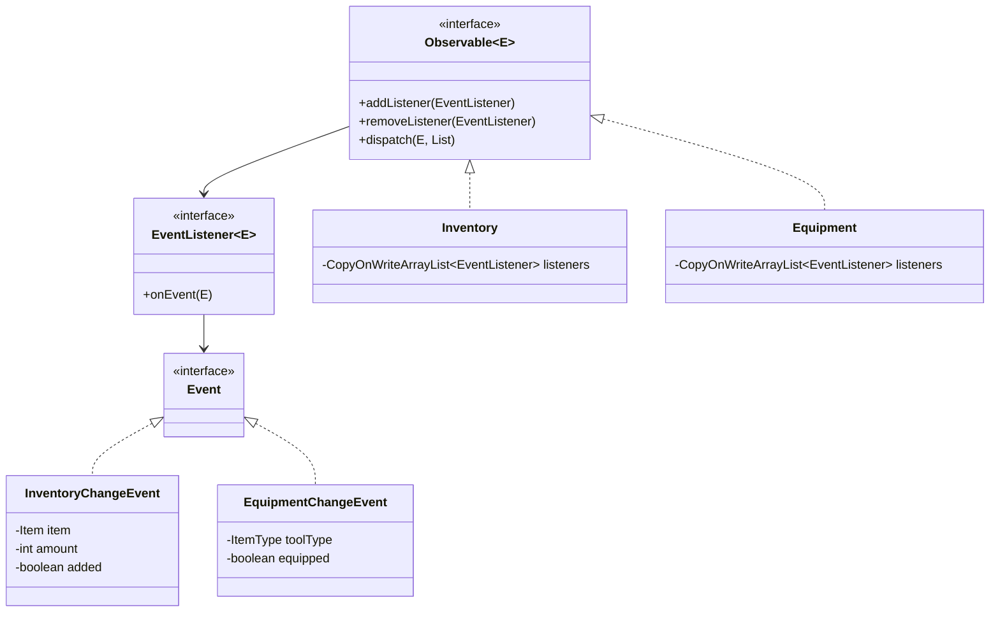
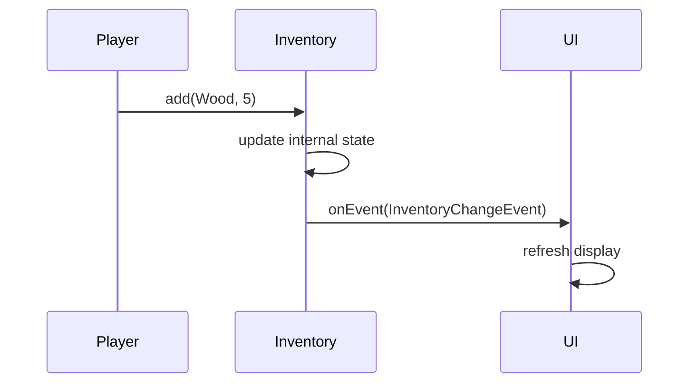

# Event System

The game uses an observer pattern for decoupling systems.

```mermaid
classDiagram
    class Event {
        <<interface>>
    }

    class EventListener~E~ {
        <<interface>>
        +onEvent(E)
    }

    class Observable~E~ {
        <<interface>>
        +addListener(EventListener)
        +removeListener(EventListener)
        +dispatch(E, List)
    }

    class InventoryChangeEvent {
        -Item item
        -int amount
        -boolean added
    }

    class EquipmentChangeEvent {
        -ItemType toolType
        -boolean equipped
    }

    class Inventory {
        -CopyOnWriteArrayList~EventListener~ listeners
    }

    class Equipment {
        -CopyOnWriteArrayList~EventListener~ listeners
    }

    Event <|.. InventoryChangeEvent
    Event <|.. EquipmentChangeEvent
    Observable <|.. Inventory
    Observable <|.. Equipment
    Observable --> EventListener
    EventListener --> Event
```

## Event Flow Example

```mermaid
sequenceDiagram
    participant Player
    participant Inventory
    participant UI

    Player->>Inventory: add(Wood, 5)
    Inventory->>Inventory: update internal state
    Inventory->>UI: onEvent(InventoryChangeEvent)
    UI->>UI: refresh display
```
