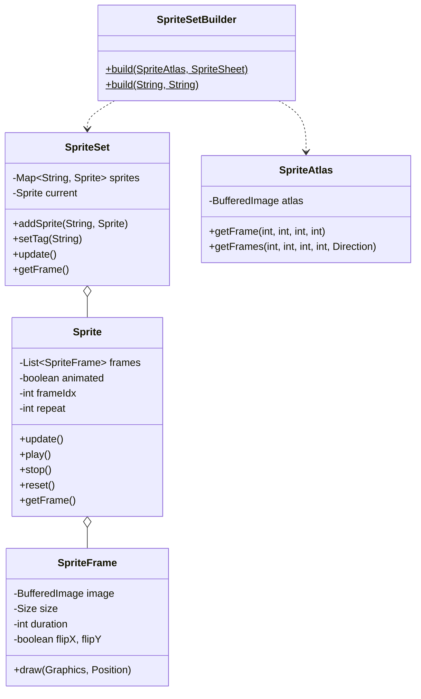

# Graphics System

Sprite animation with atlases and frame-based animation.

```mermaid
classDiagram
    class Sprite {
        -List~SpriteFrame~ frames
        -boolean animated
        -int frameIdx
        -int repeat
        +update()
        +play()
        +stop()
        +reset()
        +getFrame()
    }

    class SpriteFrame {
        -BufferedImage image
        -Size size
        -int duration
        -boolean flipX, flipY
        +draw(Graphics, Position)
    }

    class SpriteSet {
        -Map~String, Sprite~ sprites
        -Sprite current
        +addSprite(String, Sprite)
        +setTag(String)
        +update()
        +getFrame()
    }

    class SpriteAtlas {
        -BufferedImage atlas
        +getFrame(int, int, int, int)
        +getFrames(int, int, int, int, Direction)
    }

    class SpriteSetBuilder {
        +build(SpriteAtlas, SpriteSheet)$
        +build(String, String)$
    }

    Sprite o-- SpriteFrame
    SpriteSet o-- Sprite
    SpriteSetBuilder ..> SpriteAtlas
    SpriteSetBuilder ..> SpriteSet
```
