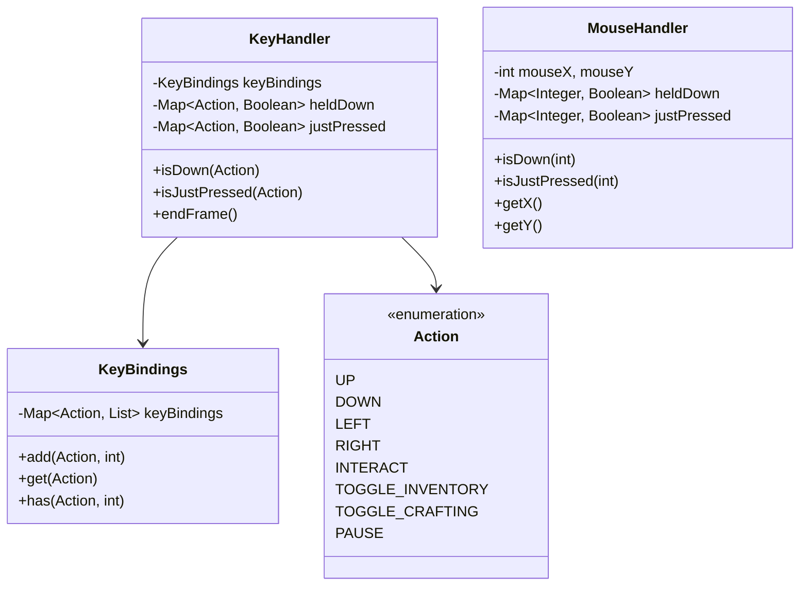

# Input System

Action-based input mapping with configurable keybindings.

```mermaid
classDiagram
    class Action {
        <<enumeration>>
        UP
        DOWN
        LEFT
        RIGHT
        INTERACT
        TOGGLE_INVENTORY
        TOGGLE_CRAFTING
        PAUSE
    }

    class KeyHandler {
        -KeyBindings keyBindings
        -Map~Action, Boolean~ heldDown
        -Map~Action, Boolean~ justPressed
        +isDown(Action)
        +isJustPressed(Action)
        +endFrame()
    }

    class KeyBindings {
        -Map~Action, List~ keyBindings
        +add(Action, int)
        +get(Action)
        +has(Action, int)
    }

    class MouseHandler {
        -int mouseX, mouseY
        -Map~Integer, Boolean~ heldDown
        -Map~Integer, Boolean~ justPressed
        +isDown(int)
        +isJustPressed(int)
        +getX()
        +getY()
    }

    KeyHandler --> KeyBindings
    KeyHandler --> Action
```
