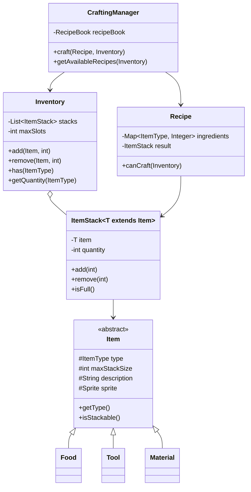
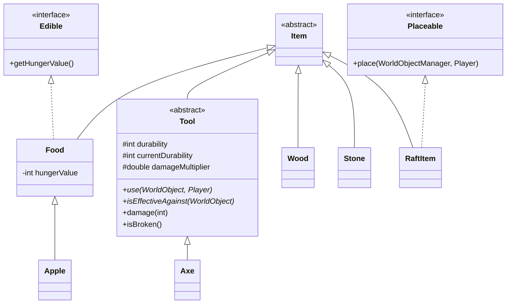

# Inventory & Crafting System

A flexible item system with stacking, crafting, and equipment management.

```mermaid
classDiagram
    class Item {
        <<abstract>>
        #ItemType type
        #int maxStackSize
        #String description
        #Sprite sprite
        +getType()
        +isStackable()
    }

    class ItemStack~T extends Item~ {
        -T item
        -int quantity
        +add(int)
        +remove(int)
        +isFull()
    }

    class Inventory {
        -List~ItemStack~ stacks
        -int maxSlots
        +add(Item, int)
        +remove(Item, int)
        +has(ItemType)
        +getQuantity(ItemType)
    }

    class Recipe {
        -Map~ItemType, Integer~ ingredients
        -ItemStack result
        +canCraft(Inventory)
    }

    class CraftingManager {
        -RecipeBook recipeBook
        +craft(Recipe, Inventory)
        +getAvailableRecipes(Inventory)
    }

    Item <|-- Food
    Item <|-- Tool
    Item <|-- Material
    ItemStack --> Item
    Inventory o-- ItemStack
    Recipe --> ItemStack
    CraftingManager --> Recipe
    CraftingManager --> Inventory
```

## Item Type Hierarchy

```mermaid
classDiagram
    class Item {
        <<abstract>>
    }

    class Food {
        -int hungerValue
    }

    class Tool {
        <<abstract>>
        #int durability
        #int currentDurability
        #double damageMultiplier
        +use(WorldObject, Player)*
        +isEffectiveAgainst(WorldObject)*
        +damage(int)
        +isBroken()
    }

    class Edible {
        <<interface>>
        +getHungerValue()
    }

    class Placeable {
        <<interface>>
        +place(WorldObjectManager, Player)
    }

    Item <|-- Food
    Item <|-- Tool
    Item <|-- Wood
    Item <|-- Stone
    Item <|-- RaftItem
    Edible <|.. Food
    Placeable <|.. RaftItem
    Tool <|-- Axe
    Food <|-- Apple
```
