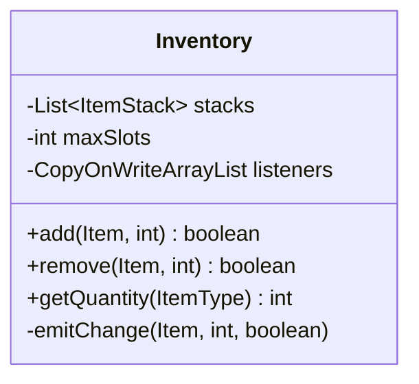
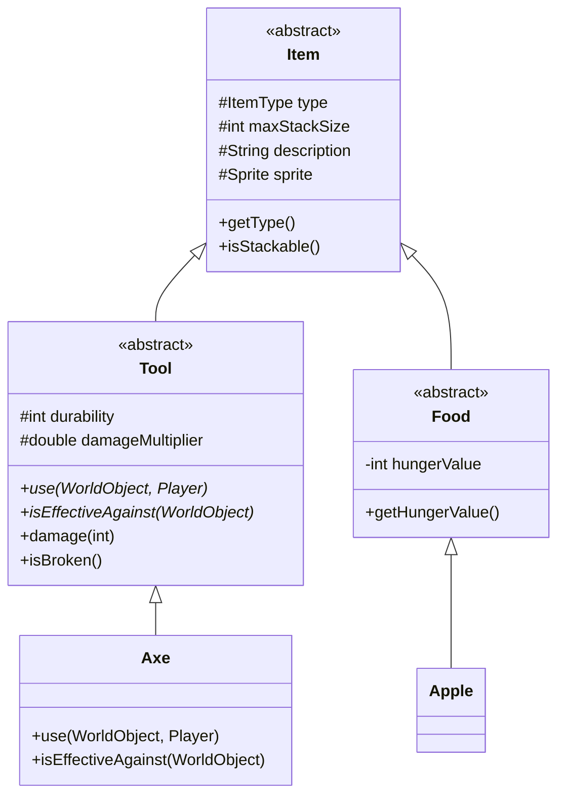
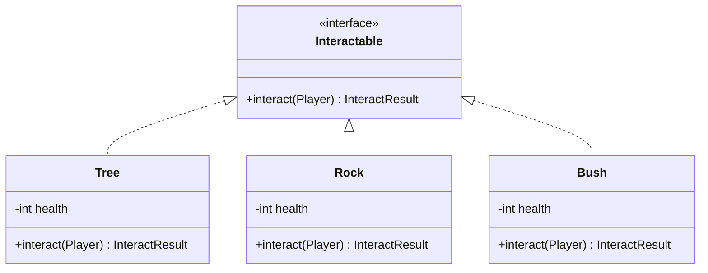

# OOP Principles Applied

## Pillars

### Encapsulation

Definition: Bundling data and methods that operate on that data within a single unit, while hiding internal implementation details.

Almost all classes encapsulate their own data and provide getters/setters.

#### Example: Inventory Class



- Private stacks list - cannot be directly accessed
- All modifications through validated public methods
- Internal state changes trigger events
- Prevents invalid state (e.g., negative quantities)

### Inheritance

Definition: Creating new classes based on existing classes, inheriting their attributes and behaviors.

`Entity` → `Player, Item` → `Wood,Stone`, `WorldObject` → `Tree`, `Rock`, …

### Example: Item Hierarchy



### Polymorphism

Definition: Objects of different types can be accessed through the same interface, with each type implementing behavior in its own way.

#### Example: Object Interactions



Different implementations:

```java
// Tree takes more damage with axe
public class Tree implements Interactable {
    public InteractResult interact(Player player) {
        Tool tool = player.getEquipment().getEquippedTool();
        if (tool instanceof Axe) {
            health -= 3;  // Effective tool
        } else {
            health -= 1;  // No tool or wrong tool
        }
        return createResult();
    }
}

// Rock doesn't care about tools
public class Rock implements Interactable {
    public InteractResult interact(Player player) {
        health--;
        return createResult();
    }
}
```

Example usage:

```java
public class InteractionManager {
    public void interact(Player player) {
        WorldObject obj = getObjectInFront(player);

        // Polymorphic call - runtime type determines behavior
        if (obj instanceof Interactable interactable) {
            InteractResult result = interactable.interact(player);
            handleResult(result);
        }
    }
}
```

### Abstraction

Definition: Hiding complex implementation details and showing only essential features of an object.

Abstract classes define common behavior without implementation (`Entity`, `Item`, `WorldObject`). Interfaces define shared behaviors (`Placeable`, `Interactable`, `Edible`). …

## SOLID

### Single Responsibility (SRP)

Each class has one clear purpose. For example, a common pattern is to have a separate loader class.

### Open/Closed (OCP)

New `Item` or `WorldObject` types can be added without modifying existing code. (See [extension points](./extension-points.md))

### Liskov Substitution (LSP)

`Player` can be used wherever `Entity` is expected. Any concrete item and world object can also be used interchangeably in `Inventory` and `WorldObjectManager`.

### Interface Segregation (ISP)

`Placeable`, `Edible`, and `Interactable` interfaces separate functionality so classes like `Item` and `WorldObject` implement only what they need (i.e. not all are placeable, edible nor interactable). For example, an `Apple` is edible, `Raft` is placeable, but `Wood` is neither.

### Dependency Inversion (DIP)

High-level modules (e.g. `Player`) depend on abstractions (e.g. `Item`, `WorldObject`) rather than concrete classes (e.g. `Wood`, `Tree`).
