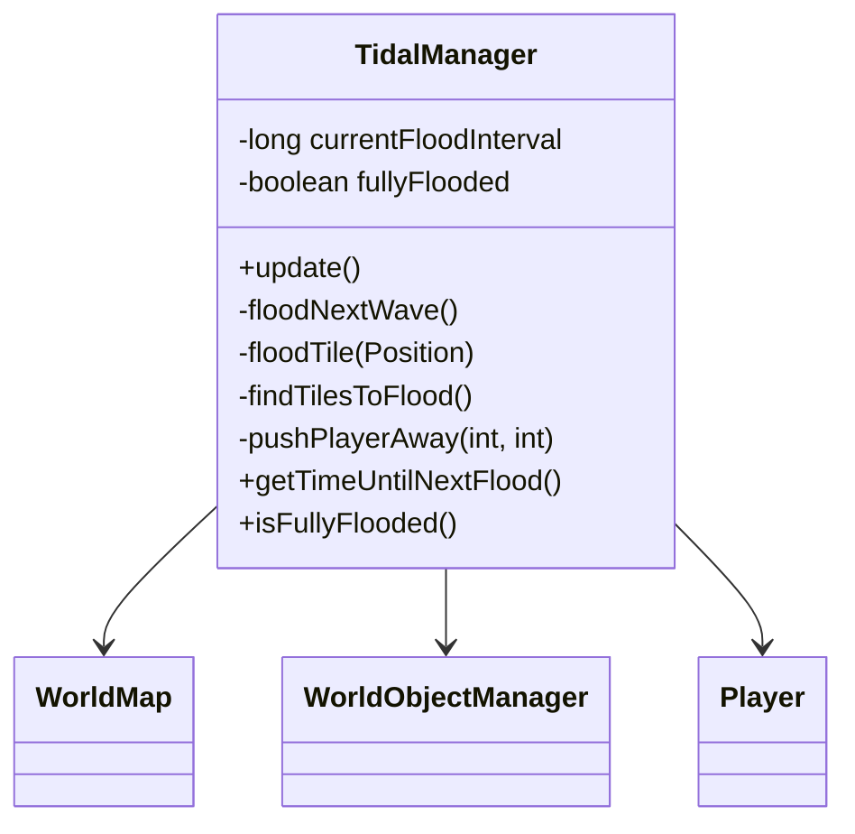
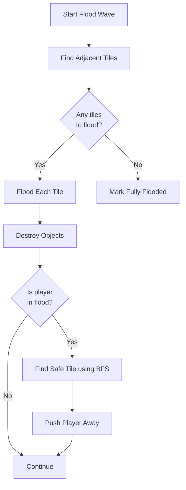

# Tidal System

The core game mechanic - flooding the island over time.

```mermaid
classDiagram
    class TidalManager {
        -long currentFloodInterval
        -boolean fullyFlooded
        +update()
        -floodNextWave()
        -floodTile(Position)
        -findTilesToFlood()
        -pushPlayerAway(int, int)
        +getTimeUntilNextFlood()
        +isFullyFlooded()
    }

    TidalManager --> WorldMap
    TidalManager --> WorldObjectManager
    TidalManager --> Player
```

## Flood Algorithm

```mermaid
graph TB
    Start[Start Flood Wave]
    Find[Find Adjacent Tiles]
    Check{Any tiles<br/>to flood?}
    Flood[Flood Each Tile]
    Destroy[Destroy Objects]
    CheckPlayer{Is player<br/>in flood?}
    Push[Push Player Away]
    FindSafe[Find Safe Tile using BFS]
    Done[Mark Fully Flooded]
    Continue[Continue]

    Start --> Find
    Find --> Check
    Check -->|No| Done
    Check -->|Yes| Flood
    Flood --> Destroy
    Destroy --> CheckPlayer
    CheckPlayer -->|Yes| FindSafe
    FindSafe --> Push
    CheckPlayer -->|No| Continue
    Push --> Continue
```
