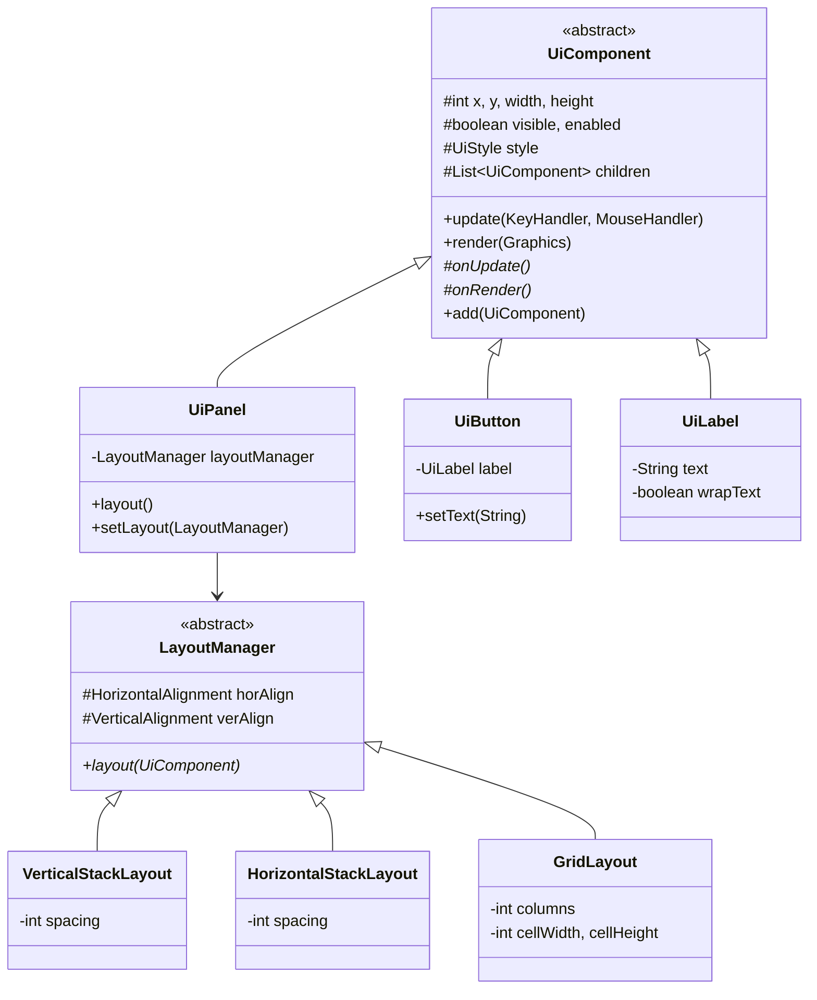
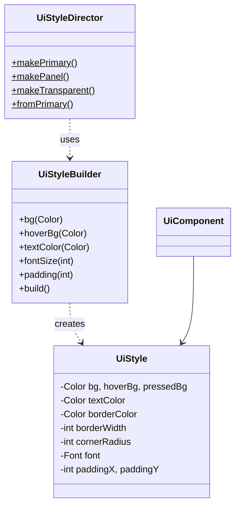

# UI System

Component-based UI with layout managers and styling.

```mermaid
classDiagram
    class UiComponent {
        <<abstract>>
        #int x, y, width, height
        #boolean visible, enabled
        #UiStyle style
        #List~UiComponent~ children
        +update(KeyHandler, MouseHandler)
        +render(Graphics)
        #onUpdate()*
        #onRender()*
        +add(UiComponent)
    }

    class UiPanel {
        -LayoutManager layoutManager
        +layout()
        +setLayout(LayoutManager)
    }

    class UiButton {
        -UiLabel label
        +setText(String)
    }

    class UiLabel {
        -String text
        -boolean wrapText
    }

    class LayoutManager {
        <<abstract>>
        #HorizontalAlignment horAlign
        #VerticalAlignment verAlign
        +layout(UiComponent)*
    }

    class VerticalStackLayout {
        -int spacing
    }

    class HorizontalStackLayout {
        -int spacing
    }

    class GridLayout {
        -int columns
        -int cellWidth, cellHeight
    }

    UiComponent <|-- UiPanel
    UiComponent <|-- UiButton
    UiComponent <|-- UiLabel
    UiPanel --> LayoutManager
    LayoutManager <|-- VerticalStackLayout
    LayoutManager <|-- HorizontalStackLayout
    LayoutManager <|-- GridLayout
```

## UI Styling

```mermaid
classDiagram
    class UiStyle {
        -Color bg, hoverBg, pressedBg
        -Color textColor
        -Color borderColor
        -int borderWidth
        -int cornerRadius
        -Font font
        -int paddingX, paddingY
    }

    class UiStyleBuilder {
        +bg(Color)
        +hoverBg(Color)
        +textColor(Color)
        +fontSize(int)
        +padding(int)
        +build()
    }

    class UiStyleDirector {
        +makePrimary()$
        +makePanel()$
        +makeTransparent()$
        +fromPrimary()$
    }

    UiStyleBuilder ..> UiStyle: creates
    UiStyleDirector ..> UiStyleBuilder: uses
    UiComponent --> UiStyle
```
