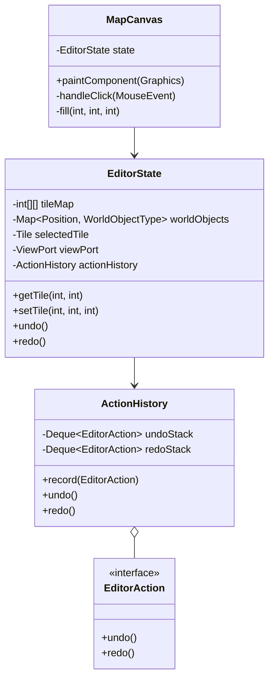

# World Builder Tool

A Swing-based level editor for creating game maps.

```mermaid
classDiagram
    class EditorState {
        -int[][] tileMap
        -Map~Position, WorldObjectType~ worldObjects
        -Tile selectedTile
        -ViewPort viewPort
        -ActionHistory actionHistory
        +getTile(int, int)
        +setTile(int, int, int)
        +undo()
        +redo()
    }

    class MapCanvas {
        -EditorState state
        +paintComponent(Graphics)
        -handleClick(MouseEvent)
        -fill(int, int, int)
    }

    class ActionHistory {
        -Deque~EditorAction~ undoStack
        -Deque~EditorAction~ redoStack
        +record(EditorAction)
        +undo()
        +redo()
    }

    class EditorAction {
        <<interface>>
        +undo()
        +redo()
    }

    MapCanvas --> EditorState
    EditorState --> ActionHistory
    ActionHistory o-- EditorAction
```
