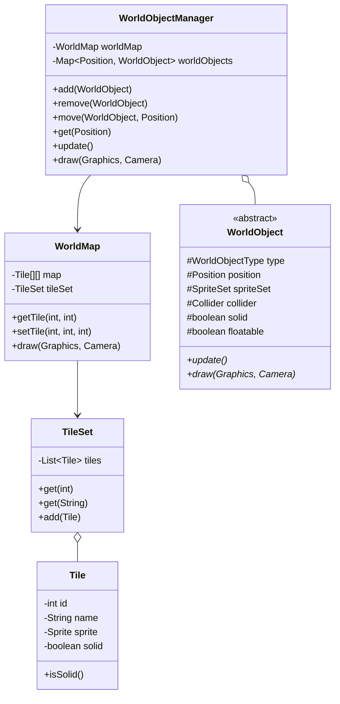
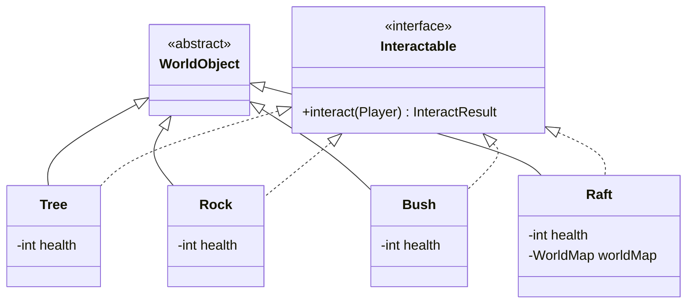

# World System

The world system manages tiles, objects, and the game map.

```mermaid
classDiagram
    class WorldMap {
        -Tile[][] map
        -TileSet tileSet
        +getTile(int, int)
        +setTile(int, int, int)
        +draw(Graphics, Camera)
    }

    class TileSet {
        -List~Tile~ tiles
        +get(int)
        +get(String)
        +add(Tile)
    }

    class Tile {
        -int id
        -String name
        -Sprite sprite
        -boolean solid
        +isSolid()
    }

    class WorldObject {
        <<abstract>>
        #WorldObjectType type
        #Position position
        #SpriteSet spriteSet
        #Collider collider
        #boolean solid
        #boolean floatable
        +update()*
        +draw(Graphics, Camera)*
    }

    class WorldObjectManager {
        -WorldMap worldMap
        -Map~Position, WorldObject~ worldObjects
        +add(WorldObject)
        +remove(WorldObject)
        +move(WorldObject, Position)
        +get(Position)
        +update()
        +draw(Graphics, Camera)
    }

    WorldMap --> TileSet
    TileSet o-- Tile
    WorldObjectManager --> WorldMap
    WorldObjectManager o-- WorldObject
```

## World Object Types

```mermaid
classDiagram
    class WorldObject {
        <<abstract>>
    }

    class Interactable {
        <<interface>>
        +interact(Player) InteractResult
    }

    class Tree {
        -int health
    }

    class Rock {
        -int health
    }

    class Bush {
        -int health
    }

    class Raft {
        -int health
        -WorldMap worldMap
    }

    WorldObject <|-- Tree
    WorldObject <|-- Rock
    WorldObject <|-- Bush
    WorldObject <|-- Raft
    Interactable <|.. Tree
    Interactable <|.. Rock
    Interactable <|.. Bush
    Interactable <|.. Raft
```
